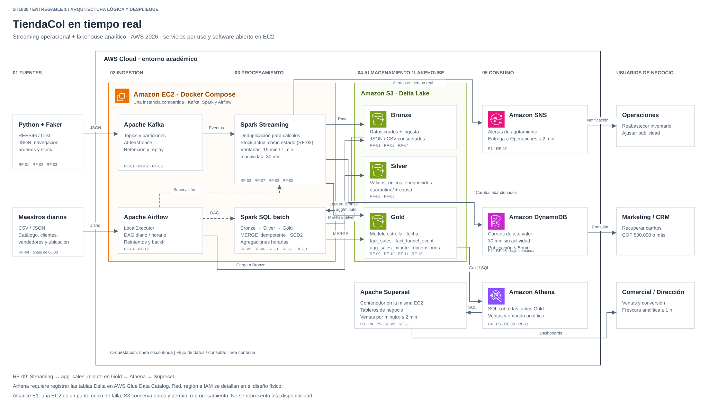

<!--
ENTREGABLE 1: documento fuente del PDF (e1_tiendacol.pdf)
Máximo 15 páginas sin anexos + diagrama en PNG/SVG. Sin código.
Todo lo que está dentro de comentarios como este NO aparece al renderizar ni al exportar: son instrucciones para el equipo.
Contexto completo, valores y reglas para agentes: CLAUDE.md (raíz del repo). En los comentarios, "Pn" solo = integrante; en el texto visible, P1–P6 = preguntas de negocio.

REPARTO Y ESTADO (integrantes)
  Integrante P1  Portada + Sección 1 + Sección 2.1 (RF) + Anexo A ............ listo para revisión
  Integrante P2  Sección 2.2 (RNF) + ADR-1 + ADR-2 ............................ pendiente
  Integrante P3  Sección 3 (diagrama) + ADR-3 ........ listo para revisión; falta publicar enlace editable
  Integrante P4  ADR-4 + ADR-5 + ADR-6 + Sección 5 (plan) ...................... pendiente

PRESUPUESTO DE PÁGINAS
  Portada (no cuenta) · 1: 1–2 · 2: 2–3 · 3: 1 · 4: 3–4 · 5: 1 · Total: 8–11 de 15

VALORES COMPARTIDOS: usar exactamente los mismos en todas las secciones (propuestos por P1, pendientes de validar con el equipo)
  Alerta de agotamiento (pregunta P1, RF-07) ...... máximo 2 min desde la venta
  Horizonte de agotamiento (pregunta P1, RF-07) ... 60 min
  Velocidad de venta (pregunta P1, RF-07) ......... últimos 15 min, recalculada cada minuto
  Carrito abandonado (pregunta P2, RF-08) ......... usuario identificado, COP 500.000 o más, 30 min sin compra ni cambios
  Publicación de la lista a Marketing (RF-08) ..... máximo 5 min después de cumplidos los 30
  Ventas por minuto (pregunta P3, RF-09) .......... visibles máximo 2 min después de cerrar el minuto
  Frescura de Gold (preguntas P4, P5, RF-10, RF-11)  máximo 1 hora
  Escala (Anexo A) ................................ 1,5 M usuarios/mes · ≈ 75 M eventos/mes · pico ≈ 3.000 ev/s · capacidad objetivo 5.000 ev/s
  P6 .............................................. dentro del alcance, como opcional (RF-13)
-->

# Universidad EAFIT

## ST1630 — Sistemas Intensivos en Datos · 2026-2

# TiendaCol en tiempo real

### Pipeline de datos para decisiones de e-commerce

**Proyecto final — Entregable 1: Diagnóstico, requisitos y arquitectura**

| | |
|---|---|
| **Nombre del proyecto** | TiendaCol en tiempo real |
| **Dominio** | E-commerce: marketplace multivendedor |
| **Profesor** | Andrés Sacre Alzate |
| **Fecha de entrega** | `[día anterior al inicio de S13]` de 2026 |
| **Repositorio** | https://github.com/juansimonEAFIT/Proyecto_sistemas-Intensivos-datos |

### Integrantes

| Nombre completo | Código EAFIT |
|---|---|
| `Juan Simón Ospina Martínez` | `1000341990` |
| `[Nombre completo P2]` | `[código]` |
| `Daniel Arcila Salazar` | `1000331599` |
| `[Nombre completo P4]` | `[código]` |

<div style="page-break-after: always;"></div>

# 1. Definición del problema

## 1.1 Contexto

TiendaCol es un marketplace colombiano (empresa ficticia) donde vendedores independientes publican productos de tecnología, hogar, moda, belleza y deportes, y los clientes compran desde la web y la app móvil. Opera en las principales ciudades del país, tiene 1,5 millones de usuarios activos al mes y recibe cerca de 2.500 órdenes en un día normal, con un ticket promedio similar al del mercado colombiano (COP 212.373 en 2025 [2]).

Compite en un mercado que crece rápido: en 2025 el comercio electrónico en Colombia vendió COP 145,4 billones en 684,6 millones de transacciones, 19,9 % más transacciones que en 2024 [2]. La demanda tampoco es uniforme. En Black Friday, Cyber Monday y el Hot Sale [6] el tráfico se multiplica en minutos: Black Friday y Cyber Monday 2025 movieron en Colombia COP 2,6 billones y 15,8 millones de transacciones electrónicas en cuatro días, y el canal en línea representó el 27 % de las ventas de Black Friday y el 37 % de las de Cyber Monday [3].

## 1.2 El problema de negocio

Hoy TiendaCol toma decisiones con reportes que salen **al día siguiente** de su base de datos transaccional. Eso le cuesta ventas en tres frentes:

1. **Productos que se agotan sin aviso durante los picos.** Un producto en tendencia que vende 5 unidades por minuto agota 300 unidades en una hora. Con reportes del día siguiente, Operaciones se entera cuando ya no puede reabastecer, avisar al vendedor ni pausar la publicidad, que sigue llevando clientes a un producto sin stock. Dos de cada tres compradores que encuentran un producto agotado terminan comprando en otra tienda [4].
2. **Carritos abandonados que nadie recupera a tiempo.** El 70,22 % de los carritos de compra en línea se abandonan [1]. A esa tasa, las 2.500 órdenes diarias de TiendaCol implican unos 5.900 carritos abandonados por día. Si cada uno vale en promedio lo mismo que una orden, son cerca de COP 1.250 millones diarios. La industria recomienda enviar el primer recordatorio dentro de la primera hora [5], pero Marketing hoy solo puede enviarlo al día siguiente. Recuperar apenas el 5 % de ese valor (supuesto ilustrativo) equivaldría a unos COP 1.900 millones al mes.
3. **Un embudo de compra que no se entiende.** No se sabe en qué paso (ver producto → agregar al carrito → pagar) se pierden los clientes, ni cómo cambia por categoría, ciudad o dispositivo. Comercial decide dónde invertir en promociones sin saber dónde está la fuga.

## 1.3 Usuarios del sistema y decisiones que toman

| Usuario | Qué necesita | Qué decide con los datos | Urgencia |
|---|---|---|---|
| **Operaciones / inventario** | Alertas de productos que se agotarán en la próxima hora | Reabastecer desde bodega, avisar al vendedor, pausar la publicidad del producto | Minutos |
| **Marketing / CRM** | Lista de carritos abandonados de alto valor | Enviar un recordatorio o un cupón mientras el cliente sigue interesado | Menos de 1 hora |
| **Category managers / Comercial** | Ventas, conversión y ticket promedio por categoría, vendedor, ciudad y día | Qué categorías promocionar, qué vendedores apoyar, dónde invertir | Horas / diaria |
| **Dirección** | Indicadores del negocio y ventas por minuto durante los eventos | Metas, presupuesto, ajuste de campañas en curso y evaluación posterior | Minutos (en eventos) / diaria |

## 1.4 Preguntas que el sistema debe responder

**Operacionales (tiempo real)**

- **P1.** ¿Qué productos se agotarán en los próximos **60 minutos** si mantienen su velocidad de venta de los últimos **15 minutos**? La alerta debe llegar a Operaciones en máximo **2 minutos** desde la venta que la dispara.
- **P2.** ¿Qué usuarios identificados dejaron un carrito con valor de **COP 500.000 o más** (unas 2,4 veces el ticket promedio del mercado [2]) sin comprar ni modificar el carrito durante **30 minutos**? La lista debe estar disponible para Marketing en máximo **5 minutos** después de cumplirse los 30, para que el recordatorio salga dentro de la primera hora [5].
- **P3.** ¿Cuántas órdenes y cuántos pesos se venden **por minuto**, en total y por categoría, durante un evento de descuentos? Cada minuto debe verse a más tardar **2 minutos** después de terminado.

**Analíticas**

- **P4.** ¿Cuál es la tasa de conversión del embudo vista de producto → carrito → compra por categoría, dispositivo (web de escritorio, web móvil, app) y ciudad, **por hora y por día**? Los datos deben tener como máximo **1 hora** de antigüedad.
- **P5.** ¿Cuáles son las ventas totales, el número de órdenes y el ticket promedio por categoría, vendedor, región y fecha? Mismo requisito de frescura: **1 hora**.
- **P6 (opcional).** ¿Qué pares de productos se compran juntos (misma orden) o se ven juntos (misma sesión) con más frecuencia? Se actualiza **una vez al día**.

## 1.5 Por qué no basta una base de datos relacional

El volumen por sí solo no es el argumento. TiendaCol genera cerca de 75 millones de eventos de navegación al mes, alrededor de 1 TB de datos crudos al año (Anexo A), y una base relacional grande podría almacenarlos. Lo que la descarta es la **combinación** de cuatro condiciones:

- **Velocidad y picos.** El tráfico pasa de unos 29 eventos por segundo en un día normal a unos 3.000 en la apertura de ofertas de Black Friday, es decir, unas **100 veces más**. Un servidor dimensionado para el pico queda ocioso el resto del año; el sistema necesita escalar horizontalmente solo cuando hace falta.
- **Cargas que compiten entre sí.** La base transaccional es la que cobra. Las consultas de P4 y P5 recorren cientos de millones de eventos, y correrlas ahí durante un pico frenaría el pago justo cuando más se vende. Por eso los reportes de hoy corren de noche, y por eso llegan con un día de retraso.
- **Variedad.** Conviven órdenes y pagos estructurados, eventos JSON cuyos campos cambian según el tipo de evento y la versión de la app, y atributos de producto distintos por categoría (tallas en moda, especificaciones técnicas en tecnología). Un esquema rígido obligaría a migraciones constantes.
- **Tiempo real.** P1, P2 y P3 pierden su valor si la respuesta tarda horas. Exigen calcular de forma continua sobre flujos de eventos, en ventanas de minutos, y no consultar periódicamente tablas ya guardadas.

# 2. Requisitos funcionales y no funcionales

## 2.1 Requisitos funcionales

Cada requisito indica a qué pregunta de negocio (Sección 1.4) responde, en qué capa del diagrama de arquitectura (Sección 3) se cumple y cómo se verifica. Los umbrales de negocio (COP 500.000, 30 minutos, etc.) son parámetros configurables.

| ID | Requisito | Trazabilidad | Cómo se verifica |
|---|---|---|---|
| **RF-01** | El sistema debe **ingestar** en tiempo real los eventos de navegación de la web y la app (`page_view`, `search`, `add_to_cart`, `remove_from_cart`, `checkout_start`, `purchase`) y **conservarlos** sin modificar en la capa Bronze, junto con su fecha y hora de ingestión. | P1–P4, P6 · Fuente → Ingestión → Bronze | Se envían 10.000 eventos de prueba con identificador único; los 10.000 aparecen en Bronze con contenido idéntico al enviado. |
| **RF-02** | El sistema debe **capturar** de la base de datos transaccional las órdenes, las líneas de orden, los pagos y los cambios de estado de envío, y llevarlos a la capa Bronze. | P3, P5 · Fuente → Ingestión → Bronze | Se crean 100 órdenes de prueba y se cambia el estado de envío de 20; Bronze contiene las 100 órdenes con sus líneas y pagos, y los 20 cambios. |
| **RF-03** | El sistema debe **recibir** cada cambio de stock por producto y bodega y **mantener** el stock disponible actual de cada producto. | P1 · Fuente → Ingestión → Procesamiento | Tras 50 cambios de stock de prueba, el stock disponible que reporta el sistema coincide con el de la fuente para todos los productos afectados. |
| **RF-04** | El sistema debe **cargar** cada día, antes de las 6:00 a. m. (hora de Colombia), el catálogo de productos (CSV/JSON) y los datos maestros de clientes y vendedores. | P4, P5 · Fuente → Ingestión por lotes → Bronze | A las 6:00 a. m. el número de productos, clientes y vendedores cargados coincide con el de los archivos fuente del día. |
| **RF-05** | El sistema debe **validar** cada registro contra su esquema esperado, **apartar** en una zona de cuarentena los que no lo cumplan sin detener el procesamiento, y **eliminar** los eventos duplicados (mismo identificador de evento). | Todas · Procesamiento Bronze → Silver | En un lote de 10.000 eventos con 100 malformados y 100 duplicados, Silver queda con 9.800 eventos únicos, la cuarentena con 100 y el procesamiento no se detiene. |
| **RF-06** | El sistema debe **enriquecer** cada evento y cada línea de orden con la categoría, el vendedor y el precio del producto (catálogo), y con la ciudad y el departamento del cliente (datos maestros). | P1–P5 · Procesamiento Silver | En una muestra de 1.000 registros de Silver, categoría, vendedor y ciudad coinciden con el catálogo y los maestros vigentes. |
| **RF-07** | El sistema debe **calcular** cada minuto la velocidad de venta de cada producto (unidades vendidas en los últimos 15 minutos) y **generar una alerta** para Operaciones cuando el stock disponible alcance para menos de 60 minutos a esa velocidad. La alerta incluye producto, vendedor, stock, velocidad y tiempo estimado de agotamiento, y llega en máximo 2 minutos desde la venta que la dispara. | P1 · Procesamiento en tiempo real → Consumo (alertas) | Se simulan ventas a velocidad constante de un producto con stock conocido; se calcula a mano la venta con la que la cobertura baja de 60 minutos, y la alerta llega máximo 2 minutos después de esa venta. |
| **RF-08** | El sistema debe **identificar** los carritos abandonados de alto valor (carritos de usuarios identificados con valor de COP 500.000 o más, sin compra ni cambios durante 30 minutos) y **publicar** la lista para Marketing (usuario, productos, valor, hora del último evento) en máximo 5 minutos después de cumplirse los 30. | P2 · Procesamiento en tiempo real → Consumo (Marketing) | Se simulan 3 sesiones: carrito de COP 600.000 sin compra (aparece entre el minuto 30 y el 35), carrito de COP 600.000 con compra en el minuto 20 (no aparece) y carrito de COP 300.000 sin compra (no aparece). |
| **RF-09** | El sistema debe **calcular** para cada minuto el número de órdenes y el valor vendido en COP, en total y por categoría, y **mostrarlo** en un tablero de monitoreo máximo 2 minutos después de terminado ese minuto. | P3 · Procesamiento en tiempo real → Consumo (tablero de eventos) | Se envía un número conocido de compras de prueba en un mismo minuto; el tablero muestra exactamente ese número y ese valor dentro de los 2 minutos siguientes. |
| **RF-10** | El sistema debe **calcular** la tasa de conversión del embudo vista de producto → carrito → compra (proporción de sesiones que pasan de cada etapa a la siguiente) por categoría, dispositivo y ciudad, por hora y por día, y **publicarla** en la capa Gold máximo 1 hora después de terminada cada hora. | P4 · Procesamiento Silver → Gold | Con un conjunto de prueba con conteos conocidos de sesiones por etapa, la consulta a Gold devuelve las mismas tasas calculadas a mano. |
| **RF-11** | El sistema debe **calcular** las ventas totales, el número de órdenes y el ticket promedio por categoría, vendedor, región (ciudad y departamento) y fecha en un modelo dimensional de la capa Gold, **consultable** con SQL y desde un tablero para Comercial y Dirección, con datos de máximo 1 hora de antigüedad. | P5 · Gold → Consumo (tablero) | Para un día de prueba, el total de ventas y de órdenes en Gold coincide exactamente con el de la base transaccional, y cada cifra del tablero coincide con la consulta directa a Gold. |
| **RF-12** | El sistema debe **ejecutar** automáticamente, en el orden de sus dependencias, los procesos programados (carga diaria de catálogo y maestros, Bronze → Silver, Silver → Gold); si un paso falla, **no ejecutar** los pasos que dependen de él y **notificar** la falla. | Todas · Orquestación (transversal) | Se fuerza una falla en la carga del catálogo; los pasos dependientes no se ejecutan y se genera una notificación. Al corregir y reintentar, el flujo termina completo sin intervención manual. |
| **RF-13** *(opcional, P6)* | El sistema debe **identificar** diariamente, para cada producto, los 10 productos que más se compran en la misma orden y los 10 que más se ven en la misma sesión. | P6 · Procesamiento → Gold o componente libre | Con un conjunto de prueba donde A y B aparecen juntos en 50 órdenes y ningún otro producto aparece con A en más de 10, B figura de primero en la lista de A. |

## 2.2 Requisitos no funcionales

<!--
P2: cada requisito debe tener un valor concreto y decir cómo se mide. La guía pide citar explícitamente los conceptos del curso:
  Escalabilidad ....... "soportar un pico de X eventos/s sin degradación" (valor compartido: 5.000 ev/s, Anexo A)
  Disponibilidad ...... posición CAP y su justificación (CP vs AP). Se decide por componente, no para todo el sistema.
  Consistencia ........ qué garantía de entrega (at-most-once / at-least-once / exactly-once) y EN QUÉ PARTE del pipeline. Puede ser distinta por flujo.
  Latencia ............ tiempo máximo desde el evento hasta Gold. Separar el tiempo real (2 min: RF-07, RF-09) de la frescura analítica (1 h: RF-10, RF-11).
  Tolerancia a fallos . qué pasa si un nodo falla y cómo se recupera (tiempo máximo sin servicio, si se pierden o se reprocesan eventos).
  Trazabilidad ........ cómo se audita el linaje de un dato desde la fuente hasta Gold (id del evento, fecha de ingestión, fuente).
Rúbrica (15 %): para el 100 % deben estar CAP, garantía de entrega, latencia, escalabilidad y tolerancia a fallos, con valores concretos.
Nota: RF-05 elimina duplicados porque la FUENTE los genera (la app reenvía eventos cuando pierde conexión), sin importar la garantía que elija el ADR-1.
-->

| ID | Categoría | Requisito | Valor concreto | Cómo se mide |
|---|---|---|---|---|
| RNF-01 | Escalabilidad | El sistema debe absorber el pico de navegación sin degradar la latencia de RNF-04, y crecer agregando particiones y ejecutores de Spark, no rediseñándose. | Capacidad de diseño: **5.000 eventos/s** (pico de ≈ 3.000 del Anexo A más margen). Clickstream en 6 particiones (ADR-1). Una sola EC2 puede no alcanzarla (ADR-6): se reporta el máximo medido. | El generador sube la carga por escalones hasta 5.000 ev/s o hasta donde aguante la EC2. Se mide el retraso del consumidor (*consumer lag*) y la latencia de RNF-04: el retraso no debe crecer de forma sostenida. |
| RNF-02 | Disponibilidad (CAP) | La posición CAP se define por componente. Kafka y Delta Lake priorizan **consistencia (CP)**; la lista de carritos en DynamoDB prioriza **disponibilidad (AP)** (ADR-4). | Kafka: *acks=all* y un solo broker en el E1; en producción, 3 brokers con `min.insync.replicas=2` (CP). Delta Lake en S3: escrituras ACID con aislamiento serializable (ADR-3). DynamoDB: lectura del índice eventualmente consistente (ADR-4). | Se inspecciona la configuración de cada componente. Se detiene un broker de prueba y se verifica que el productor no confirme escrituras sin réplica suficiente. |
| RNF-03 | Consistencia (garantía de entrega) | El sistema no debe perder eventos entre la fuente y Bronze, y no debe contar dos veces un evento duplicado. | ***At-least-once*** de la fuente a Kafka y de Kafka a Bronze y a los jobs de streaming. La deduplicación por `event_id` la hacen los jobs de streaming (RF-07 a RF-09) y Silver (RF-05). Las escrituras a Delta usan `MERGE`, de modo que reprocesar da el mismo resultado (ADR-1, ADR-2, ADR-3). | **0** eventos perdidos y **0** duplicados en Silver y Gold: se envían 10.000 eventos de prueba y 100 de ellos se reenvían, como hace la app. Bronze conserva los 10.100 recibidos y Silver queda con 10.000 únicos. |
| RNF-04 | Latencia | La latencia se mide del momento del evento a su disponibilidad, separando el tiempo real de la frescura analítica. | Alerta de agotamiento (RF-07) y ventas por minuto (RF-09): máx. **2 min**. Lista de carritos (RF-08): máx. **5 min** tras cumplirse los 30 de inactividad. Evento a Gold (RF-10, RF-11): máx. **1 hora**. | Diferencia entre la hora del evento y la hora de la alerta, del tablero o de la fila en Gold, con los eventos de prueba de cada RF. Se reporta el máximo observado en la demo. |
| RNF-05 | Tolerancia a fallos | Si un job de Spark falla, debe reanudarse solo desde donde quedó, sin perder ni duplicar eventos. Si la EC2 falla, no deben perderse los datos de Bronze, Silver y Gold. | Job de Spark: reinicio por Airflow en máx. **5 min** (ADR-5) desde su *checkpoint* en S3; durante ese lapso RF-07 puede no cumplir sus 2 min. EC2 caída: Bronze, Silver y Gold siguen en S3; se levanta otra EC2 con el mismo `docker-compose.yml`. `[PENDIENTE: tiempo máximo de recuperación de la EC2]` | Se detiene a la fuerza el contenedor del job en plena carga. Se mide el tiempo hasta que reanuda y se comprueba que los conteos en Silver coinciden con los enviados, sin pérdidas ni duplicados. |
| RNF-06 | Trazabilidad | Debe poder seguirse cualquier cifra de Gold hasta el evento u orden de origen. | Bronze guarda el `event_id`, la fuente, la hora de ingestión y la partición y el *offset* de Kafka. Silver y Gold conservan `event_id` u `order_id`. Los registros rechazados quedan en `quarantine/` con su causa. El *time travel* de Delta (ADR-3) permite reproducir una cifra pasada. | **100 %** de las filas de `fact_funnel_event` y `fact_sales` enlazan con su registro en Bronze mediante `event_id` u `order_id`. Se verifica con una consulta de cruce. |

<!-- PENDIENTE (P2 y equipo): los valores de particiones y del reinicio de 5 min vienen del ADR-1 y del ADR-5. El tiempo máximo de recuperación de la EC2 (RNF-05) falta definirlo con P4. La disponibilidad en % no se fija: una sola EC2 en un laboratorio con temporizador (ADR-6) no permite prometerla, y el E1 no representa alta disponibilidad (nota del diagrama). -->

<!-- Defensa (P2): RNF-02, CAP por componente. Kafka con un solo broker no sufre particiones de red, así que su posición CAP es teórica en el E1; con 3 brokers y `min.insync.replicas=2` rechazaría escrituras sin quórum (CP). RNF-03: "exactly-once" de extremo a extremo exigiría además un destino transaccional en cada salida; aquí se logra el efecto solo donde importa (Delta con MERGE), y por eso la garantía es at-least-once + deduplicación. -->


# 3. Diagrama de arquitectura de datos por capas

<!--
P3: un solo diagrama con las 5 capas, exportado en PNG/SVG de alta resolución como docs/entregable1/arquitectura.png (o .svg), más el enlace editable de Draw.io o Lucidchart.
La guía pide mostrar en cada capa:
  Fuente .......... sistemas origen, con su formato y frecuencia
  Ingestión ....... mecanismo de transporte y garantía de entrega
  Procesamiento ... transformaciones y qué cambia entre la entrada y la salida
  Almacenamiento .. Bronze, Silver y Gold con el motor de cada una y el modelo de Gold (star schema)
  Consumo ......... cómo consumen los usuarios (tablero, alertas, SQL, API)
Cada caja debe tener el nombre de la herramienta concreta ("Delta Lake en S3", no "base de datos").
Para que los RF sean "trazables al diagrama", anotar sobre cada caja los ID de los RF que cumple (ver la tabla de abajo).
Rúbrica (25 %): legible sin explicación adicional. Si necesita más de 2 minutos de explicación, le falta claridad.
-->

**Fuente editable:** [diagrama de Draw.io (`arquitectura.drawio`)](arquitectura.drawio) · **Enlace compartido:** `[PENDIENTE: publicar o subir el archivo en Draw.io y pegar aquí la URL editable]`



| Capa | Componentes (herramienta concreta) | Qué hace | RF que cumple |
|---|---|---|---|
| Fuente | Generador Python con Faker `es_CO`; archivos REES46 y Olist | Emite clickstream, órdenes y cambios de stock como JSON continuo; publica catálogo y maestros en CSV cada día antes de las 6:00 a. m. La ciudad de una sesión, aun anónima, se genera como atributo de contexto de la sesión, sin identificar a la persona. | RF-01, RF-02, RF-03, RF-04 |
| Ingestión | Apache Kafka en EC2; carga diaria de Airflow hacia S3 | Kafka recibe los flujos continuos con entrega *at-least-once*, particiones y retención para *replay*. Airflow deposita la carga diaria directamente en Bronze. | RF-01, RF-02, RF-03, RF-04 |
| Procesamiento | Apache Spark Structured Streaming y Spark SQL en EC2 | Valida esquema, manda inválidos a cuarentena, deduplica por `event_id`, enriquece con catálogo, calcula ventanas de 15 y 1 minuto y sesiones de 30 minutos, y genera las agregaciones horarias de Gold. | RF-05, RF-06, RF-07, RF-08, RF-09, RF-10, RF-13 |
| Almacenamiento: Bronze | Delta Lake en Amazon S3 (`bronze/`) | Conserva el dato recibido y sus metadatos de ingesta, sin aplicar reglas de negocio; permite releerlo y auditar la fuente. | RF-01, RF-02, RF-04 |
| Almacenamiento: Silver | Delta Lake en Amazon S3 (`silver/` y `quarantine/`) | Guarda eventos válidos, deduplicados y enriquecidos; separa registros inválidos con la causa del rechazo. | RF-05, RF-06 |
| Almacenamiento: Gold | Delta Lake en Amazon S3 (`gold/`), modelo estrella | Publica `fact_sales` y `fact_funnel_event` con dimensiones conformadas de fecha/hora, producto, cliente, vendedor, ubicación y dispositivo. Se particiona por fecha del evento. | RF-10, RF-11, RF-13 |
| Consumo | Amazon Athena, Apache Superset, Amazon SNS y Amazon DynamoDB | Athena consulta Gold con SQL; Superset muestra el embudo, ventas y ventas por minuto; SNS entrega alertas de agotamiento; DynamoDB sirve la lista de carritos a Marketing. | RF-07, RF-08, RF-09, RF-11 |
| Orquestación (transversal) | Apache Airflow con `LocalExecutor` en EC2 | Programa las cargas diaria y horaria, supervisa los jobs continuos, aplica dependencias, reintentos y notificación de fallos. | RF-12 |

# 4. Justificación de decisiones técnicas (ADRs)

<!--
Rúbrica (25 %): al menos 5 ADRs completos con contexto, alternativas, decisión y consecuencias, y cada ADR debe citar conceptos del curso.
Las 5 decisiones mínimas que pide la guía son ADR-1 a ADR-5. El ADR-6 es opcional, pero conviene decidirlo temprano porque limita a los demás (Kinesis y Athena solo existen en AWS).
"Alternativas consideradas" debe decir por qué se descartó cada opción PARA ESTE PROBLEMA, no en general.
"Consecuencias" debe decir qué se sacrifica.
-->

## ADR-1. Motor de streaming y garantía de entrega

<!--
Responsable: P2
Insumos para el contexto: clickstream JSON continuo · pico de 5.000 ev/s (Anexo A) · RF-01, RF-07, RF-08 y RF-09 exigen tiempo real · el enunciado prohíbe simular el streaming con batch.
Conceptos a citar:
  Garantías: at-most-once (se puede perder, no se duplica) · at-least-once (no se pierde, se puede duplicar) · exactly-once (de extremo a extremo: fuente re-leíble + checkpoints + destino idempotente o transaccional; no es solo del broker).
  Particiones: unidad de paralelismo; el orden solo se garantiza dentro de una partición; la clave del mensaje decide la partición.
  Retención: permite reprocesar (replay) después de un error.
Preguntas que deben poder responder:
  1. Por tipo de evento, ¿qué es peor: perderlo o duplicarlo? (un purchase duplicado infla la velocidad de venta de RF-07; un add_to_cart perdido esconde un carrito de RF-08)
  2. ¿Qué garantía se configura y en qué punto se logra?
  3. ¿Qué clave de partición? (RF-07 agrupa por producto, RF-08 por usuario; cuidado con las particiones "calientes" de un producto en tendencia)
  4. ¿Cuántas particiones para 5.000 ev/s y por qué?
  5. ¿Cuánta retención?
  6. ¿Está atado a una plataforma (ADR-6)?
-->

**Contexto.** Los RF-01, RF-07, RF-08 y RF-09 exigen procesar el clickstream en tiempo real, y el enunciado prohíbe simular el streaming con batch. El tráfico pasa de ≈ 29 eventos/s en un día normal a ≈ 3.000 en la apertura de ofertas de Black Friday, con una capacidad objetivo de 5.000 eventos/s (Anexo A), unos 5 MB/s a 1 KB por evento. Hace falta un transporte que amortigüe esos picos entre la fuente y el procesamiento, que conserve los eventos para poder reprocesarlos tras una falla y que reparta el trabajo en paralelo. Además, la app reenvía eventos cuando pierde conexión, así que los duplicados nacen en la fuente (RF-05). Por el ADR-6, el transporte corre en un contenedor de la misma EC2 que Spark y Airflow, y se descartan los servicios que cobran por hora encendidos.

**Alternativas consideradas.**

| Alternativa | Ventajas para este problema | Desventajas / por qué se descarta |
|---|---|---|
| Kafka | Es la referencia que cita la guía del curso (S6-S7). Corre en un contenedor del `docker-compose.yml` y no cobra por hora. Las particiones reparten la carga y conservan el orden dentro de cada una. La retención permite releer eventos (*replay*). Se integra con Spark Structured Streaming, que guarda los *offsets* leídos en su *checkpoint*. | Hay que operarlo: versiones compatibles con Spark y memoria de la EC2. Con un solo broker no hay réplicas. |
| Kinesis | Gestionado: AWS lo opera y lo escala por *shards*. | Cobra por *shard*-hora encendido, y con USD 50 de presupuesto un recurso olvidado pone en riesgo la cuenta (ADR-6). No corre en un `docker-compose.yml`, que exige el E2, y solo existe en AWS. |
| Redpanda | Compatible con la API de Kafka y más liviano en memoria. | La guía no lo cita y el equipo no lo ha usado. Su ahorro de memoria no compensa aprender otra herramienta en las tres semanas antes de S16, cuando Kafka ya cubre el requisito. |

**Decisión.** Se elige **Apache Kafka** en un contenedor de la EC2, con garantía ***at-least-once***. Las dos garantías descartadas fallan en este problema. *At-most-once* puede perder eventos: perder un `add_to_cart` esconde un carrito del RF-08 y no se puede recuperar. Un duplicado, en cambio, se elimina por `event_id`, así que para este problema duplicar es menos grave que perder. *Exactly-once* de extremo a extremo exigiría además un destino transaccional en cada salida [12][13]; el equipo lo logra solo donde importa, en Delta Lake con `MERGE` (ADR-3). El resultado es at-least-once con deduplicación, que tiene el mismo efecto en Gold.

La garantía se configura en tres puntos. El productor usa `acks=all` e idempotencia, lo que evita duplicados por sus propios reintentos hacia Kafka [12]. Spark guarda en su *checkpoint* los *offsets* leídos y los avanza después de escribir en el destino: si el job cae a mitad de un lote, relee ese lote y lo procesa otra vez [13]. Los duplicados de la fuente, más los de esa relectura, se eliminan por `event_id` en los jobs de streaming (ADR-2) y en Silver (RF-05).

Diseño de los topics `[propuesta de P2, pendiente de validar con el equipo]`:

| Topic | Clave de partición | Particiones | Por qué |
|---|---|---|---|
| `clickstream` | `user_id` (`session_id` si el usuario es anónimo) | 6 | El orden solo se garantiza dentro de una partición [12]: con esta clave, los eventos de un mismo usuario llegan en orden, lo que necesita el RF-08 para saber si hubo compra después del carrito. Reparte la carga de forma pareja. Seis particiones dejan unos 830 ev/s por partición a 5.000 ev/s, permiten hasta seis tareas de Spark en paralelo y no gastan la memoria de la EC2. |
| `orders` | `order_id` | 3 | Volumen bajo (24.000 órdenes en un día de Black Friday). Con `product_id` como clave, un producto en tendencia saturaría una sola partición (partición caliente). |
| `stock_changes` | `product_id` | 3 | El último cambio de stock de cada producto debe procesarse en orden (RF-03). |

El RF-07 agrupa por producto, pero no se usa `product_id` como clave del clickstream: Spark reagrupa por producto al calcular la ventana, y así se evita la partición caliente. La retención es de **7 días**, suficiente para reprocesar tras un fin de semana con el laboratorio apagado por su temporizador (ADR-6).

**Consecuencias.**

- **Los duplicados llegan a los consumidores.** Todo job de streaming tiene que deduplicar por `event_id`, lo que cuesta memoria para guardar los identificadores recientes y algo de latencia.
- **Un solo broker significa sin réplicas.** Si se cae o pierde su disco, el flujo se detiene y los eventos aún no leídos pueden perderse. `acks=all` no añade durabilidad sin una segunda réplica. En un despliegue real serían tres brokers con factor de replicación 3 y `min.insync.replicas=2`.
- **El orden solo existe por usuario.** No hay orden global entre usuarios, y cualquier cálculo por producto implica que Spark reparta los datos de nuevo entre tareas.
- **Las particiones no se reducen, y aumentarlas cambia a qué partición va cada clave**, lo que rompe el orden de los eventos ya guardados. Por eso se fija el número desde ahora con margen.
- **La retención ocupa disco.** Siete días son unos 18 GB en un día normal (2,5 millones de eventos a 1 KB, unos 2,5 GB por día) pero unos 170 GB con el tráfico de Black Friday. El tamaño del disco de la EC2 queda pendiente en el ADR-6.
- **Kafka consume memoria de la EC2** que comparte con Spark y Airflow, y su versión debe ser compatible con el conector de Spark (riesgo de la Sección 5).

<!-- PENDIENTE (P2 y equipo): el diseño de topics, claves, particiones (6/3/3) y la retención de 7 días los propuso P2 con el agente; falta validarlos con el equipo. Confirmar con P1 (generador) que el evento trae `user_id` o `session_id`, y con P4 el disco de la EC2. -->

## ADR-2. Motor de procesamiento

<!--
Responsable: P2
Insumos para el contexto: RF-07 (ventana de 15 min), RF-08 (30 min sin actividad), RF-09 (por minuto), RF-06 (join con catálogo y maestros), RF-10 y RF-11 (agregaciones). Latencias de 2 min y 1 h.
El enunciado exige Spark en al menos una transformación no trivial (join, ventanas o agregación).
Conceptos a citar:
  Micro-batch vs por evento: Spark Structured Streaming procesa en lotes pequeños (latencia de segundos); Flink procesa evento a evento (latencia de milisegundos).
  Checkpoints: guardan offsets y estado para reanudar sin perder ni repetir trabajo.
  Ventanas: tumbling (RF-09), sliding (RF-07), session (RF-08).
  Watermarks: cuánto esperar los eventos tardíos (tiempo del evento vs tiempo de procesamiento; la app móvil puede enviar eventos con minutos de retraso).
Preguntas que deben poder responder:
  1. ¿Micro-batch cumple los 2 min con margen?
  2. ¿Qué ventana y qué tamaño usa cada RF?
  3. ¿Qué watermark y por qué?
  4. RF-08 detecta la AUSENCIA de un purchase: ¿cómo se expresa eso en el motor?
  5. ¿Qué pasa si el job se cae a mitad de un pico? ¿Dónde viven los checkpoints?
  6. Si eligen Flink, ¿dónde queda Spark?
  7. Batch puro no sirve para el tiempo real (lo prohíbe el enunciado): expliquen por qué se descarta y si sirve en otra parte del pipeline.
-->

**Contexto.** `[...]`

**Alternativas consideradas.**

| Alternativa | Ventajas para este problema | Desventajas / por qué se descarta |
|---|---|---|
| Spark Structured Streaming | `[...]` | `[...]` |
| Flink | `[...]` | `[...]` |
| Batch puro | `[...]` | `[...]` |

**Decisión.** `[...]`

**Consecuencias.** `[...]`

## ADR-3. Formato de la capa Gold y modelo dimensional

<!--
Responsable: P3
La guía pide justificar el motor de Gold y POR QUÉ el modelo dimensional es adecuado para el caso.
Insumos para el contexto: RF-10 (P4) y RF-11 (P5) · variedad de datos (JSON, atributos por categoría) · catálogo que cambia cada día.
  Hechos candidatos: ventas por línea de orden; eventos del embudo.
  Dimensiones candidatas: cliente, producto, categoría, vendedor, fecha/hora, ubicación, dispositivo/canal.
Conceptos a citar: ACID (streaming y batch escriben en las mismas tablas) · schema evolution · time travel · star schema · grano.
Preguntas que deben poder responder:
  1. ¿Cuál es el grano de cada tabla de hechos?
  2. ¿Qué medidas se pueden sumar? (el ticket promedio NO se suma: es ventas / órdenes)
  3. ¿Cómo responde el modelo a P4 y P5? Explíquenlo en palabras; si no se puede, falta algo.
  4. El precio y la categoría cambian: ¿se guarda el precio pagado en el hecho? ¿Hay historia en la dimensión (SCD)?
  5. ¿Qué se hace en Silver y qué en Gold?
  6. ¿Qué motores leen Gold y son compatibles con el formato?
  7. ¿Cómo se particiona físicamente (por fecha)?
  8. En P4 "por ciudad": ¿de dónde sale la ciudad de una sesión anónima?
-->

**Contexto.** Los RF-10 y RF-11 exigen que Gold responda con una frescura máxima de una hora la conversión del embudo y las ventas por categoría, vendedor, región y fecha. Spark escribe simultáneamente resultados de streaming y de procesos horarios sobre S3 (ADR-2 y ADR-6), por lo que un conjunto de archivos Parquet sin capa transaccional podría dejar lecturas parciales durante una falla o un reintento. Además, el catálogo cambia cada día, llegan atributos distintos según la categoría y la garantía *at-least-once* obliga a realizar escrituras idempotentes. Gold necesita, por tanto, transacciones ACID, control y evolución del esquema, `MERGE` para corregir o reprocesar datos y versiones auditables. También debe ser consultable desde Spark y Athena, y presentar un modelo que los usuarios puedan recorrer sin reconstruir las relaciones operacionales.

**Alternativas consideradas.**

| Alternativa | Ventajas para este problema | Desventajas / por qué se descarta |
|---|---|---|
| Delta Lake | Ofrece transacciones ACID con aislamiento serializable, unifica lectura y escritura *batch* y *streaming*, permite `MERGE`, evolución controlada del esquema y *time travel* sobre S3 [9]. Tiene integración directa con Spark y Athena puede consultar sus tablas con SQL y aprovechar estadísticas para omitir archivos [10]. El equipo ya usó esta combinación en el laboratorio del curso. | La partición es explícita y debe diseñarse y mantenerse; el log `_delta_log` y los archivos pequeños requieren compactación y limpieza periódicas. Su mejor integración sigue siendo con Spark, lo que aumenta el acoplamiento al ADR-2. |
| Apache Iceberg | También ofrece aislamiento serializable, evolución segura del esquema, *time travel* y compatibilidad con Spark. Su particionamiento oculto y la evolución de la especificación permiten cambiar la distribución física sin reescribir consultas [11]. | Para este volumen y un único motor de escritura, la evolución avanzada de particiones no compensa incorporar otro catálogo y una tecnología que el equipo no ha usado. La implementación y la defensa tendrían más riesgo sin mejorar las preguntas P4 y P5. |

**Decisión.** Se elige **Delta Lake sobre Amazon S3** para Bronze, Silver y Gold. En Gold se implementa un esquema en estrella con dimensiones conformadas y claves sustitutas:

| Tabla | Grano | Contenido principal |
|---|---|---|
| `fact_sales` | Una línea de producto de una orden confirmada | `order_id` como dimensión degenerada, cantidad, precio unitario pagado, descuento y valor neto. El precio pagado queda en el hecho para no cambiar la historia cuando se actualiza el catálogo. |
| `fact_funnel_event` | Un evento válido de `page_view`, `add_to_cart` o `purchase` para un producto dentro de una sesión | `event_id`, `session_id`, etapa, cantidad y claves de tiempo, producto, cliente, ubicación y dispositivo. Conserva al cliente desconocido para sesiones anónimas. |
| `dim_datetime` | Un minuto calendario | Fecha, hora, día, semana y mes en hora de Colombia. |
| `dim_product` | Una versión de un producto | Producto, nombre y categoría. Usa SCD tipo 2 (`valid_from`, `valid_to`, `is_current`) para conservar cambios de categoría; los nuevos atributos opcionales evolucionan el esquema. |
| `dim_customer` | Un cliente identificado, más la fila “desconocido” | Identificador seudonimizado y estado de identificación. |
| `dim_seller` | Un vendedor | Identificador y atributos comerciales del vendedor. |
| `dim_location` | Una ciudad y departamento | Ciudad del contexto de sesión o de la orden; una fila “desconocida” evita perder eventos sin ubicación. |
| `dim_device` | Un tipo de dispositivo o canal | Web de escritorio, web móvil o app. |

P4 se obtiene contando sesiones distintas que alcanzan cada etapa de `fact_funnel_event` y dividiendo las que compran por las que ven un producto, agrupadas por categoría de `dim_product`, dispositivo, ciudad y hora o día. P5 suma el valor neto de `fact_sales`, cuenta `order_id` distintos y calcula el ticket promedio como **ventas / órdenes** —nunca como suma de promedios— por categoría, vendedor, región y fecha. Ambas tablas de hechos se particionan físicamente por la fecha del evento; no se particionan por categoría o vendedor para evitar muchas particiones pequeñas. Spark hace escrituras idempotentes con `MERGE` por `event_id` o por `(order_id, product_id)`, y Athena consulta las tablas Gold con SQL.

**Consecuencias.**

- Las transacciones ACID evitan que Athena lea una actualización incompleta, y el *time travel* permite reproducir una cifra y auditar cambios. A cambio, el equipo debe administrar el historial y definir políticas de retención y `VACUUM` sin borrar versiones todavía necesarias.
- La historia del producto queda correcta mediante SCD tipo 2 y el precio pagado permanece en el hecho. Esto aumenta filas y obliga a resolver la clave sustituta vigente durante el enriquecimiento de Silver a Gold.
- La partición diaria favorece P4 y P5, que filtran por tiempo, pero una consulta puntual por vendedor sin rango temporal escaneará más archivos. Los micro-*batches* pueden producir archivos pequeños, por lo que el DAG horario debe compactarlos.
- Delta reduce el riesgo de implementación por su integración con Spark y la experiencia previa del equipo, pero crea mayor dependencia de ese ecosistema que Iceberg.
- El esquema estrella duplica algunos atributos descriptivos y requiere procesos de dimensiones, pero simplifica las consultas y evita que Comercial tenga que unir el modelo transaccional. Los pares de productos del RF-13, si se implementan, se materializan como una tabla Gold derivada y no cambian el grano de los dos hechos obligatorios.

## ADR-4. Componente libre

<!--
Responsable: P4
La guía pide justificar la elección y su POSICIÓN CAP en el contexto del problema.
Candidatos que ya aparecen en los RF: servir la lista de RF-08 a Marketing, las consultas de RF-11 o los pares de RF-13 (P6).
Conceptos a citar:
  CAP: la clasificación depende de la configuración (nivel de consistencia en Cassandra, write/read concern en MongoDB); citen la configuración, no solo la etiqueta.
  Sharding · partition key (se elige a partir de las consultas que se van a hacer; una mala clave crea hot spots).
Preguntas que deben poder responder:
  1. ¿Qué RF o usuario lo necesita, y por qué el lakehouse solo no basta?
  2. ¿Cuál es el patrón de acceso? (búsqueda por clave con baja latencia, SQL analítico, recorrido de relaciones)
  3. Para ese uso, ¿qué es peor: un dato algo desactualizado o no responder? (AP vs CP)
  4. ¿Qué partition key y qué consulta la motiva?
  5. ¿Quién alimenta el componente y con qué frecuencia?
  6. Si es un motor de consulta (Trino/Athena), CAP aplica menos: justifiquen con separación de cómputo y almacenamiento, formatos soportados y costo por datos escaneados.
-->

**Contexto.** El RF-08 exige publicar para Marketing, en máximo 5 minutos, la lista de carritos abandonados de alto valor. Eso tiene dos patrones de acceso: buscar el carrito de un usuario puntual y listar los carritos abandonados del día, de mayor a menor valor. El job de streaming actualiza estos registros sin parar, y con la garantía at-least-once del ADR-1 puede escribir el mismo evento más de una vez. El lakehouse no sirve para esto: Delta Lake o Iceberg en S3 son buenos para recorrer muchos datos de una vez, no para responder en milisegundos por una clave que cambia cada pocos segundos. Por el ADR-6, el componente tiene que correr en un contenedor o cobrar por uso, y la EC2 ya comparte su memoria entre el broker, Spark y Airflow.

**Alternativas consideradas.**

| Alternativa | Ventajas para este problema | Desventajas / por qué se descarta |
|---|---|---|
| DynamoDB (bajo demanda) | Búsqueda por clave en milisegundos. Es distribuido de verdad y la consistencia se elige en cada lectura. Cobra por petición y no usa memoria de la EC2. Guardar por clave reemplaza el registro, así que los duplicados de at-least-once no hacen daño. | Solo existe en AWS. Solo responde bien a las consultas para las que se diseñaron sus claves. El equipo no lo ha usado. |
| MongoDB | Guarda cada carrito como un documento con sus productos, sin esquema fijo. Consistencia configurable con *write concern* y *read concern*. | En una sola EC2 corre con un solo nodo: nunca hay partición de red, así que su posición CAP sería teórica. Consume memoria de la EC2. |
| PostgreSQL | El equipo lo conoce. Consultas SQL libres. `INSERT … ON CONFLICT` tolera duplicados. | Contradice la Sección 1.5, que argumenta contra las bases relacionales por su esquema rígido y su escalado vertical. Con un solo nodo, el CAP tampoco aplica. El compose de Airflow ya trae un PostgreSQL para sus metadatos, y mezclar ahí datos de negocio es mala práctica. |
| Cassandra | AP con consistencia ajustable. Hecha para muchas escrituras. | Es la más pesada en memoria, en una EC2 compartida. Su fuerza es la escritura masiva distribuida, que con un solo nodo no se aprovecha. |
| Redis | La más rápida en búsquedas por clave. | Vive en memoria: compite por RAM con Airflow y Spark, y sin configurar persistencia pierde los datos al reiniciar. |
| Neo4j | Modela relaciones entre productos. | Solo serviría para el RF-13, que es opcional. No resuelve el RF-08. |
| Trino / Athena | SQL sobre Gold sin mover los datos, separando cómputo y almacenamiento. | Son motores de consulta analítica: no responden en milisegundos por clave. Atienden el RF-11, no el RF-08. |

**Decisión.** Se elige DynamoDB en modo bajo demanda para servir la lista del RF-08. La tabla `carritos_abandonados` usa `user_id` como partition key: cada usuario tiene a lo sumo un carrito activo, así que la clave reparte la carga de forma pareja entre particiones y responde la búsqueda de un usuario puntual. Un índice secundario global usa la fecha de abandono como partition key y el valor en COP como sort key, para listar los carritos del día de mayor a menor valor. El job de streaming del RF-08 (ADR-2) escribe cada carrito con su `user_id`, de modo que un evento duplicado reemplaza el registro en lugar de duplicarlo. En CAP, la lista de Marketing se lee desde el índice, cuyas lecturas son siempre eventualmente consistentes [8]: para Marketing es peor que la lista no cargue que verla con segundos de atraso, dentro de un plazo de 5 minutos. El sistema favorece la disponibilidad (AP). Antes de enviar un cupón, la búsqueda del usuario puntual se hace con lectura fuertemente consistente sobre la tabla base [8], que sí la permite, para no premiar a alguien que acaba de comprar. Los contenedores acceden a DynamoDB con el mismo rol de instancia de la EC2 (ADR-6).

<!-- PENDIENTE (P4): la consola del Learner Lab abre el formulario de "Crear tabla" de DynamoDB (verificado el 2026-09-29), pero falta confirmar que la creación funcione, creando y borrando una tabla de prueba en modo bajo demanda. Si no funciona, el plan B es MongoDB en contenedor, y este ADR se reescribe. El diseño de claves e índice lo propuso el agente y falta validarlo con el equipo. -->

**Consecuencias.**

- **Dependencia de AWS.** DynamoDB solo existe en AWS y no forma parte del `docker-compose.yml`: vive fuera de la EC2. Para desarrollar sin gastar presupuesto, se puede usar DynamoDB Local en un contenedor.
- **Las consultas quedan atadas al diseño de claves.** Una pregunta nueva, como "carritos por ciudad", necesita otro índice. Esa flexibilidad se sacrifica frente a PostgreSQL.
- **Marketing puede ver un carrito que ya se compró**, durante los segundos que tarda en propagarse el cambio al índice. Por eso la verificación antes del cupón usa lectura fuerte, que cuesta el doble que la eventual [8].
- **Todos los carritos de un día comparten partición en el índice.** Con el volumen de TiendaCol no es un problema, pero a mayor escala habría que repartir esa clave, por ejemplo agregándole la hora.
- **El equipo tiene que aprender a diseñar claves en DynamoDB**, en las tres semanas antes de S16.

## ADR-5. Orquestación

<!--
Responsable: P4
La guía pide justificar la herramienta y CÓMO SE MODELAN LAS DEPENDENCIAS DEL DAG.
Insumos para el contexto: RF-12 · fuentes diarias (RF-04) y continuas (RF-01 a RF-03) · Bronze → Silver → Gold.
Conceptos a citar: DAG · dependencias · reintentos · idempotencia (un "append" duplica filas si se reintenta; sobrescribir la partición del día o un MERGE no).
Preguntas que deben poder responder:
  1. ¿Qué tareas tiene el DAG y qué depende de qué? (se puede incluir un mini-diagrama)
  2. El streaming corre sin parar: ¿qué papel tiene el orquestador frente a él? El enunciado pide "todo el pipeline orquestado".
  3. ¿Cada tarea es idempotente? ¿Cómo?
  4. ¿Qué pasa si una tarea falla a las 3 a. m.?
  5. ¿Cómo se reprocesan días pasados (backfill)?
-->

**Contexto.** El RF-12 exige ejecutar automáticamente los procesos programados en el orden de sus dependencias y, si un paso falla, no ejecutar los que dependen de él y notificar la falla. TiendaCol mezcla dos ritmos: procesos que arrancan y terminan (la carga diaria del catálogo y los maestros antes de las 6:00 a. m. del RF-04, y el paso Bronze → Silver → Gold cada hora para cumplir la frescura de 1 hora de los RF-10 y RF-11) y jobs de streaming que corren sin parar (RF-07, RF-08 y RF-09). Un paso que corre con datos incompletos produce cifras equivocadas sin que nadie lo note: si falla la carga del catálogo, el enriquecimiento del RF-06 pegaría a cada venta la categoría del día anterior. Además, cada paso se puede reintentar, y la guía exige que el pipeline completo esté orquestado. Por el ADR-6, el orquestador corre en un contenedor sobre la misma EC2 que el broker, Spark y el componente libre.

**Alternativas consideradas.**

| Alternativa | Ventajas para este problema | Desventajas / por qué se descarta |
|---|---|---|
| Airflow | Es la referencia del curso (S11). Cumple el RF-12 por defecto: si un paso falla, los que dependen de él quedan marcados como `upstream_failed` y no corren. Cada ejecución sabe qué intervalo de tiempo procesa, así que el backfill es nativo. Tiene sensores para esperar datos en S3 y avisos cuando un paso falla. | Es el más pesado de los tres: su `docker-compose` oficial trae 8 servicios y la documentación pide al menos 4 GB de memoria, idealmente 8 GB [7], en una EC2 que comparte con el resto del pipeline. |
| Dagster | Modela el pipeline como activos de datos (las tablas Bronze, Silver y Gold) y muestra su linaje, lo que ayuda al requisito de trazabilidad. Backfill nativo por particiones. Más liviano que Airflow. | No se ve en el curso: el equipo aprendería una herramienta nueva sin material de apoyo, en las tres semanas antes de S16. |
| Prefect | El más liviano: los flujos son funciones de Python. | No tiene un concepto propio de intervalo de datos, así que el backfill se arma a mano pasando la fecha como parámetro. Tampoco se ve en el curso. |

**Decisión.** Se elige Airflow, con el `LocalExecutor` en lugar del `CeleryExecutor` del compose oficial: los pasos corren como procesos en el mismo contenedor del scheduler, lo que elimina Redis y el worker aparte y baja el consumo de memoria en la EC2. Las dependencias se modelan en tres DAG:

```
dag_diario   (5:00 a. m., hora de Colombia)
  cargar_catalogo ──┐
                    ├──► maestros_a_silver
  cargar_maestros ──┘

dag_horario  (cada hora)
  esperar_bronze ──► bronze_a_silver ──► enriquecer ──┬──► gold_embudo  (RF-10)
  (sensor en S3)       (RF-05)           (RF-06)      └──► gold_ventas  (RF-11)
                                  esperar_catalogo ──┘
                                  (catálogo del día cargado)

dag_streaming  (cada 5 minutos)
  verificar_jobs ──► reiniciar_si_caido ──► notificar
  (RF-07, RF-08, RF-09)
```

El orquestador no ejecuta el streaming, porque un job que nunca termina no cabe en una tarea que empieza y termina: lo supervisa. `dag_streaming` revisa que cada job siga vivo y avanzando, lo arranca solo si no está corriendo y avisa si tuvo que reiniciarlo. La recuperación dentro del job la hacen sus checkpoints (ADR-2). En `dag_horario`, `esperar_bronze` es un sensor que no deja avanzar hasta que el streaming haya escrito en Bronze la hora completa, y `enriquecer` también espera a que el catálogo del día esté cargado. Cada paso se reintenta ante fallas pasajeras y, si falla del todo, los que dependen de él no corren y un aviso de falla notifica al equipo, como pide el RF-12. Todos los pasos son idempotentes: en lugar de agregar filas, cada uno sobrescribe la partición de su intervalo o hace un MERGE, según el formato del ADR-3. Así, un reintento o un backfill deja el mismo resultado que una sola ejecución. La zona horaria se configura explícitamente, porque Airflow programa en UTC por defecto y el RF-04 está en hora de Colombia.

<!-- PENDIENTE (P4 y equipo): la herramienta la eligió P4 aceptando la recomendación del agente, sin discusión del equipo todavía. Validar con P1, P2 y P3. Confirmar también la hora del dag_diario (5:00 a. m.) y la frecuencia de dag_streaming (5 min). -->

**Consecuencias.**

- **Airflow consume memoria que el resto del pipeline no puede usar.** Aun con el `LocalExecutor`, la EC2 tiene que ser más grande y cuesta más por hora. Este costo se suma al tamaño de instancia pendiente del ADR-6.
- **Mientras la EC2 está apagada, no corre ningún DAG.** Con el temporizador del Learner Lab, la carga de las 5:00 a. m. no se ejecuta si el laboratorio está cerrado. Al encenderlo, los intervalos pendientes se recuperan con backfill, algo que solo es seguro porque los pasos son idempotentes.
- **La supervisión del streaming tiene un retraso.** Si un job se cae justo después de una revisión, pasan hasta 5 minutos antes de reiniciarlo. En ese tiempo el RF-07 no cumple su máximo de 2 minutos.
- **El `LocalExecutor` no reparte trabajo entre máquinas.** Si el pipeline creciera hacia los 5.000 eventos por segundo del Anexo A, habría que volver al `CeleryExecutor` o a un despliegue con varios workers.
- **Se renuncia al linaje de tablas de Dagster.** El linaje de Bronze a Gold tendrá que documentarse aparte para el requisito de trazabilidad.

## ADR-6. Plataforma (opcional)

<!--
Responsable: P4
Conceptos a citar: servicios gestionados · reproducibilidad (el README debe permitir correr todo desde cero) · costo.
Preguntas que deben poder responder:
  1. ¿Dónde corre la demo en vivo de S16 y qué pasa si falla la red?
  2. Si es local: ¿qué portátil aguanta al mismo tiempo el broker, el procesamiento, el orquestador y el componente libre? Medirlo pronto.
  3. Si es nube: ¿qué créditos tienen, cuánto costaría un mes y cómo evitan recursos olvidados encendidos?
  4. ¿Qué condiciona en los otros ADRs?
-->

**Contexto.** El pipeline de TiendaCol necesita correr al mismo tiempo cinco piezas: un broker de streaming, un motor de procesamiento con Spark, el almacenamiento Bronze/Silver/Gold en formato de tabla abierta, un orquestador y el componente libre. La plataforma debe cumplir tres condiciones del proyecto: el E2 exige un `docker-compose.yml` que levante el pipeline desde cero siguiendo el README, la demo de S16 corre en vivo frente al docente, y cualquier integrante debe poder reproducir el entorno. El equipo cuenta con una cuenta de AWS Academy Learner Lab, que impone límites propios: un presupuesto fijo de USD 50 que, si se agota, desactiva la cuenta y borra todo el trabajo; sesiones con temporizador que apagan las instancias al terminar, mientras otros servicios siguen cobrando fuera de la sesión; la imposibilidad de crear roles IAM, de modo que solo se usan los que trae el laboratorio; y una única región, `us-east-1`. Por último, el sistema está dimensionado para 5.000 eventos por segundo (Anexo A), pero la demo procesa un volumen mucho menor: la plataforma debe poder crecer hasta esa capacidad sin que el equipo pague hoy por ella.

<!-- PENDIENTE (P4): confirmar en el Learner Lab que el presupuesto real es USD 50. -->

**Alternativas consideradas.**

| Alternativa | Ventajas para este problema | Desventajas / por qué se descarta |
|---|---|---|
| AWS todo administrado (Kinesis o MSK, EMR, MWAA) | El equipo no instala ni opera servidores: AWS administra el broker, el procesamiento y el orquestador, y los escala solo. | MSK, EMR y MWAA cobran por cada hora encendidos, aunque no procesen nada. Según el material del curso (Clase 6), un clúster EMR encendido 48 horas cuesta cerca de USD 14: con USD 50 y una cuenta que se borra al agotarlos, un servicio olvidado pone en riesgo todo el proyecto. Además, estos servicios no se pueden levantar con un `docker-compose.yml`, que es lo que exige el E2. |
| AWS híbrido: contenedores en EC2 + lakehouse en S3 | El cómputo (broker, Spark y orquestador) corre en contenedores sobre una EC2, que deja de cobrar cuando se apaga. El almacenamiento (Bronze, Silver y Gold en S3, en el formato de tabla abierta que elija el ADR-3) cobra por uso y sobrevive si la EC2 falla. El mismo `docker-compose.yml` corre en un portátil y en la nube. Reutiliza lo hecho en el Lab 1b: tablas Delta Lake en S3 consultadas con Athena. | La EC2 es un punto único de falla del cómputo: si se cae, el streaming se detiene hasta que se levante otra. El equipo administra las versiones y la configuración de cada contenedor. Los contenedores necesitan permiso para escribir en S3 sin claves que caduquen a mitad de la demo. |
| Local con Docker | No cuesta nada, no tiene temporizador de sesión y la demo no depende de la red del salón. | Las cinco piezas tienen que caber a la vez en el portátil de la demo, y cada integrante tiene una máquina distinta. Los datos quedan en un disco local y no en almacenamiento de objetos, que es la base del lakehouse que enseña el curso. No hay forma de crecer hacia los 5.000 eventos por segundo del Anexo A. |
| GCP | Tiene servicios equivalentes para cada capa (Pub/Sub, Dataproc, Cloud Composer, BigQuery) y un programa de créditos educativos. | El equipo ya tiene AWS Academy activo y todos los laboratorios del curso se hicieron en AWS, así que cambiar de nube suma aprendizaje sin resolver ningún requisito. Dataproc y Cloud Composer también cobran por hora encendidos, así que el problema de presupuesto de la primera alternativa se repite. |

**Decisión.** Se elige el enfoque híbrido en AWS Academy, con una regla de costo: un servicio se usa administrado solo si cobra por uso; si cobraría por hora encendido, corre en un contenedor. Por eso el broker, Spark y el orquestador corren con `docker-compose` sobre una instancia EC2, y Bronze, Silver y Gold viven en S3 en formato de tabla abierta. La decisión se apoya en la separación de cómputo y almacenamiento: el cómputo es reemplazable (si la EC2 falla, se levanta otra con el mismo `docker-compose.yml`) y los datos persisten en S3, que cobra por GB guardado y escala sin que el equipo lo administre. El mismo archivo levanta el pipeline en el portátil de cualquier integrante y en la nube, lo que cumple el requisito de reproducibilidad del E2. Los contenedores acceden a S3 con el rol de instancia que provee el laboratorio, y no con claves copiadas a mano, que caducan con cada sesión.

<!-- PENDIENTE (P4): confirmar en la consola del Learner Lab que se puede asociar un rol de instancia (instance profile) a una EC2, y definir el tamaño de la instancia cuando el equipo sepa qué contenedores corren. -->

**Consecuencias.**

- **La EC2 es un punto único de falla del cómputo.** Si se cae, el streaming y el orquestador se detienen hasta levantar otra instancia. Los datos no se pierden, porque están en S3.
- **El equipo opera los contenedores.** Nadie administra por ellos las versiones del broker, de Spark y del formato de tabla, y esas versiones tienen que ser compatibles entre sí. Este riesgo pasa a la Sección 5.
- **El pipeline no corre de forma continua.** El temporizador del Learner Lab apaga la EC2 al terminar cada sesión. Para la demo hay que iniciar el laboratorio con anticipación, y el procesamiento tiene que poder reanudarse desde donde quedó (checkpoints, ADR-2).
- **Una sola EC2 no alcanza los 5.000 eventos por segundo del Anexo A.** Llegar a ese volumen exigiría repartir el cómputo en varias máquinas o pasarlo a servicios administrados. El almacenamiento en S3 no tendría que cambiar.
- **El disco de la EC2 sigue cobrando con la instancia apagada**, aunque su costo es bajo frente al de un servicio encendido.
- **Condiciona los otros ADRs.** Descarta los servicios que cobran por hora encendidos: Kinesis para el ADR-1, MWAA para el ADR-5, y bases administradas como RDS o DocumentDB para el ADR-4. Deja abiertos los que corren en contenedores o cobran por uso, como Athena o DynamoDB en modo bajo demanda, si el laboratorio los permite.

# 5. Plan de implementación

<!--
Responsable: P4
La guía pide: qué componente implementa cada integrante, hitos intermedios antes de S16 y riesgos técnicos con su plan de mitigación.
Rúbrica (10 %): cronograma realista y riesgos con mitigación. Un cronograma vago o riesgos sin mitigación bajan la nota al 60 %.
Fechas del curso: S13 retroalimentación del E1 · S14 asesoría de implementación (opcional) · S16 presentación (10 min) + demo en vivo (8 min) + defensa (7 min), con el PR final abierto antes de las 11:59 p. m. del día anterior y un ensayo obligatorio ese mismo día.
Riesgos candidatos (evaluar cuáles aplican):
  los datasets son demasiado grandes para los portátiles del equipo;
  incompatibilidad de versiones entre broker, motor de procesamiento y formato de tabla;
  la demo en vivo falla por red, recursos o credenciales (¿plan B con datos precargados?);
  costos de nube por recursos que quedan encendidos;
  en la defensa le preguntan a un integrante por la parte que no implementó.
-->

## 5.1 Responsabilidades

Cada integrante implementa en el E2 los componentes de la sección del E1 que escribió. Cada RF tiene un responsable, salvo el RF-08, que se reparte: P2 detecta los carritos abandonados en el streaming y P4 los publica en DynamoDB.

| Integrante | Componente(s) que implementa | RF que cubre |
|---|---|---|
| **P1** · Juan Simón Ospina Martínez | Generador de eventos que simula las fuentes (clickstream, órdenes, stock, catálogo), carga diaria del catálogo y los maestros, y las pruebas de la columna "Cómo se verifica" de la Sección 2.1 | RF-04 · pruebas de todos los RF |
| **P2** · `[nombre]` | Kafka, ingesta de las fuentes a Bronze y los jobs de streaming con Spark | RF-01, RF-02, RF-03, RF-07, RF-08, RF-09 |
| **P3** · Daniel Arcila Salazar | Bronze → Silver → Gold con Spark, modelo dimensional de Gold y consultas de consumo | RF-05, RF-06, RF-10, RF-11 · RF-13 si hay tiempo |
| **P4** · Juan José Díaz Rodríguez | `docker-compose.yml`, EC2 y S3, los tres DAG de Airflow, la tabla de DynamoDB, README, bitácora de IA y PR | RF-12 · publicación del RF-08 |

<!-- PENDIENTE (equipo): nombre de P2. Este reparto del E2 lo propuso el agente a partir del reparto del E1; falta validarlo. -->

## 5.2 Cronograma hasta S16

| Semana | Hito | Responsable(s) | Criterio de "terminado" |
|---|---|---|---|
| S13 | Esqueleto de punta a punta: `docker-compose.yml` mínimo con Kafka, Spark y Airflow sobre la EC2, versiones fijadas, tabla de DynamoDB creada. Ajuste de los ADR con la retroalimentación del E1 | P4 (plataforma), P2 (Kafka), P1 (generador) | Un evento del generador llega a Bronze en S3. `docker compose up` levanta sin errores. La memoria usada por la EC2 queda medida y anotada |
| S14 | Streaming y Silver: jobs de RF-07, RF-08 y RF-09; validación, cuarentena y deduplicación; enriquecimiento; `dag_diario` y `dag_horario` corriendo | P2, P3, P4 | Pasan las pruebas de RF-05, RF-06, RF-07, RF-08 y RF-09 de la Sección 2.1 |
| S15 | Gold y consumo: modelo dimensional, consultas de P4 y P5, `dag_streaming`, README, bitácora y borrador de slides. Explicación cruzada de componentes | Todos | Un integrante que no escribió el código levanta el pipeline desde cero siguiendo el README. Pasan todas las pruebas de la Sección 2.1 |
| S16 | Presentación, demo en vivo y defensa | Todos | PR final abierto y demo ensayada de principio a fin el día anterior |

## 5.3 Riesgos técnicos y mitigación

| Riesgo | Probabilidad | Impacto | Mitigación |
|---|---|---|---|
| Se agota el presupuesto de AWS Academy y se borra la cuenta (ADR-6) | Media | Alto | Terminar el laboratorio al cerrar cada sesión y no usar servicios que cobren por hora. P4 revisa el gasto cada semana. El código vive en git, no solo en la EC2. |
| La EC2 no aguanta a la vez Kafka, Spark y Airflow (ADR-5, ADR-6) | Media | Alto | Medir la memoria con el compose mínimo en S13 antes de elegir el tamaño de la instancia. Airflow con `LocalExecutor` y límite de memoria por contenedor. |
| Versiones incompatibles entre Spark, el conector de Kafka y el formato de tabla (ADR-1 a ADR-3) | Media | Alto | Fijar las versiones exactas en el compose desde S13 y probar un camino mínimo de punta a punta antes de construir lo demás. |
| El Learner Lab no permite crear tablas en DynamoDB (ADR-4) | Baja | Medio | Confirmarlo antes del E1 creando y borrando una tabla de prueba. Plan B: MongoDB en contenedor. |
| Falla la demo en vivo por la red, la sesión del laboratorio o las credenciales | Media | Alto | Ensayo completo el día anterior, iniciar el laboratorio con anticipación y tener un dataset precargado. Plan B: correr el mismo compose en un portátil (ADR-6). |
| Un integrante no sabe defender una parte que no implementó | Media | Alto | En S15, cada integrante le explica su componente a otro y el equipo hace un simulacro con las preguntas típicas de la guía. |

<div style="page-break-after: always;"></div>

# Anexo A. Supuestos de dimensionamiento de TiendaCol

Valores supuestos para la empresa ficticia, coherentes con el mercado colombiano [2][3]. Los requisitos no funcionales (Sección 2.2) usan estas mismas cifras.

| Supuesto | Día normal | Black Friday / Cyber Monday |
|---|---|---|
| Usuarios activos al mes | 1,5 millones | — |
| Sesiones por día | 100.000 | 800.000 |
| Eventos por sesión | 25 | 30 |
| Eventos por día | 2,5 millones | 24 millones |
| Eventos por segundo, promedio del día | ≈ 29 | ≈ 280 |
| Eventos por segundo, hora pico | ≈ 55 (8 % del tráfico del día) | ≈ 1.000 (15 % del tráfico del día) |
| Eventos por segundo, minutos de apertura de ofertas | — | ≈ 3.000 (3 veces la hora pico) |
| Capacidad objetivo con margen | — | **5.000 eventos/s** |
| Conversión de sesión a orden | 2,5 % | 3 % |
| Órdenes por día | 2.500 | 24.000 |
| Ventas por día (ticket de COP 212.373 [2]) | ≈ COP 530 millones | ≈ COP 5.100 millones |
| Eventos de navegación al mes | ≈ 75 millones | — |
| Datos crudos al año (≈ 1 KB por evento) | ≈ 1 TB | — |

Como control de realismo: las ventas anuales de TiendaCol (≈ COP 194.000 millones) serían cerca del 0,13 % del comercio electrónico colombiano de 2025 [2], una escala plausible para un marketplace mediano.

# Referencias

1. Baymard Institute. *Cart Abandonment Rate Statistics* (promedio de 50 estudios, actualizado el 22 de septiembre de 2025). https://baymard.com/lists/cart-abandonment-rate
2. Cámara Colombiana de Comercio Electrónico (CCCE). *Informe de cierre ecommerce 2025, versión pública* (febrero de 2026). https://ccce.org.co/noticias/informe-de-cierre-ecommerce-2025-version-publica/
3. Infobae, con datos de Credibanco. *Black Friday y Cyber Monday 2025 dejaron ventas por encima de 2,6 billones de pesos en Colombia* (6 de diciembre de 2025). https://www.infobae.com/tecno/2025/12/06/black-friday-y-cyber-monday-2025-dejaron-ventas-por-encima-de-26-billones-de-pesos-en-colombia/
4. SGB Media, sobre la encuesta de AlixPartners (2024). *Study: Out-of-Stocks Drive 66 Percent of Consumers to Another Retailer*. https://sgbonline.com/study-out-of-stocks-drive-66-percent-of-consumers-to-another-retailer/
5. Rejoiner. *When Is the Best Time to Send an Abandoned Cart Email?* (fuente de la industria). https://www.rejoiner.com/resources/abandoned-cart-email-timing
6. Cámara Colombiana de Comercio Electrónico (CCCE). *Llega una nueva versión de Hot Sale en Colombia* (2025). https://ccce.org.co/noticias/llega-una-nueva-version-de-hotsale-en-colombia/
7. Apache Software Foundation. *Running Airflow in Docker*, documentación de Apache Airflow 3.3.2 (consultada el 29 de septiembre de 2026). https://airflow.apache.org/docs/apache-airflow/stable/howto/docker-compose/index.html
8. Amazon Web Services. *DynamoDB read consistency*, Amazon DynamoDB Developer Guide (consultada el 29 de septiembre de 2026). https://docs.aws.amazon.com/amazondynamodb/latest/developerguide/HowItWorks.ReadConsistency.html
9. Delta Lake. *Welcome to the Delta Lake documentation* (consultada el 29 de septiembre de 2026). https://docs.delta.io/
10. Amazon Web Services. *Query Delta Lake tables with SQL*, Amazon Athena User Guide (consultada el 29 de septiembre de 2026). https://docs.aws.amazon.com/athena/latest/ug/delta-lake-tables-querying.html
11. Apache Software Foundation. *Evolution*, Apache Iceberg documentation (consultada el 29 de septiembre de 2026). https://iceberg.apache.org/docs/latest/evolution/

12. Apache Software Foundation. *Design: Message Delivery Semantics*, documentación de Apache Kafka (consultada el 30 de septiembre de 2026). https://kafka.apache.org/43/design/design/
13. Apache Software Foundation. *Structured Streaming Programming Guide*, documentación de Apache Spark (consultada el 30 de septiembre de 2026). https://spark.apache.org/docs/latest/streaming/getting-started.html

<!-- P2, P3 y P4: agregar aquí sus referencias, sin repetir números. -->
<!-- P4 usó la [7] y la [8]; P3 usó de la [9] a la [11]; P2 usó la [12] y la [13]. La siguiente disponible es la [14]. -->

<!--
====================================================================
REVISIÓN CRUZADA ANTES DE EXPORTAR (P1 → P2, P2 → P3, P3 → P4, P4 → P1)
  [ ] Los valores compartidos (comentario del inicio) son iguales en todas las secciones.
  [ ] Cada RF aparece en el diagrama y cada caja del diagrama cumple algún RF.
  [ ] Cada herramienta del diagrama está justificada en un ADR o en el texto.
  [ ] Los RNF son alcanzables con lo que eligen los ADRs (p. ej., si un RNF exige exactly-once, ADR-1 y ADR-2 explican cómo se logra).
  [ ] Cada ADR compara al menos 2 alternativas de verdad y cita conceptos del curso.
  [ ] El modelo del ADR-3 responde P4 y P5.
  [ ] Se cumplen las restricciones obligatorias: streaming real, Spark no trivial, Bronze/Silver/Gold, Gold dimensional consultable, orquestación y componente libre.
  [ ] Portada con los nombres completos y los códigos EAFIT de los 4 integrantes.
  [ ] 15 páginas o menos sin anexos. Si no cabe, pasar la columna "Cómo se verifica" de la Sección 2.1 a un anexo.
  [ ] Checklist de la guía: PDF en docs/entregable1/e1_tiendacol.pdf, diagrama en docs/entregable1/arquitectura.png o .svg, enlace editable en la Sección 3 y PR abierto con la descripción del proyecto.

====================================================================
NOTAS DE DEFENSA DE P1: por qué cada valor (cualquier integrante debe poder explicarlas)

  P1, horizonte de 60 min: tiempo mínimo para actuar (mover stock, llamar al vendedor, pausar una campaña). Con 15 min no alcanza a actuar nadie; con 24 h la alerta es ruido.
  P1, velocidad de los últimos 15 min: detecta a tiempo que un producto se volvió tendencia sin reaccionar a una sola compra grande. Con 1 min habría falsas alarmas; con 1 h, se notaría tarde.
  P1, alerta en 2 min: es pequeña frente al horizonte de 60 min (quedan al menos 58 para actuar). Bajarla a segundos no cambia la decisión y encarece el sistema.
  P2, COP 500.000: unas 2,4 veces el ticket promedio de la CCCE (COP 212.373). Un cupón solo se justifica en carritos grandes. Es configurable.
  P2, 30 + 5 min: el recordatorio sale antes de la primera hora, que es la ventana que recomienda la industria. Con menos de 30 min se molesta a quien sigue comparando.
  P2, solo usuarios identificados: a un anónimo no hay a quién escribirle, pero sí cuenta en el embudo de P4.
  P3, por minuto y visible en 2 min: Dirección ajusta campañas en curso; se reutiliza el límite de 2 min de P1 para no tener dos valores distintos.
  P4 y P5, 1 hora: P4 se pide "por hora" y Comercial decide en horas o días. Pedir tiempo real aquí encarece el sistema sin cambiar ninguna decisión.
  5.000 ev/s: Anexo A, fila por fila (pico de ≈ 3.000 en la apertura de ofertas + margen de ≈ 1,7 veces). Si cambia un supuesto, se recalcula.
  Sección 1.5: ~1 TB al año NO justifica por sí solo una arquitectura distribuida; la justifica la COMBINACIÓN de picos de 100 veces, cargas que compiten, variedad y tiempo real. Decirlo así es más defendible que exagerar el volumen.
  Los RF dicen QUÉ hace el sistema, no con qué herramienta, para no tomar decisiones que les tocan a P2, P3 y P4.

  Cómo los RF cubren las restricciones obligatorias:
    Streaming ........... RF-01, RF-07, RF-08, RF-09
    Spark: join ......... RF-06 · Spark: ventanas ... RF-07, RF-08, RF-09 · Spark: agregación ... RF-10, RF-11
    Bronze / Silver / Gold ... RF-01, RF-02, RF-04 / RF-05, RF-06 / RF-10, RF-11
    Gold dimensional .... RF-11 · Orquestación ... RF-12 · Componente libre ... candidatos RF-08, RF-11, RF-13 (lo decide el ADR-4)

  Nota sobre los eventos: el Cyberlunes de la CCCE se dejó de hacer después de 2023; por eso el texto usa Black Friday, Cyber Monday y Hot Sale, que sí tienen datos de 2025.
====================================================================
-->
